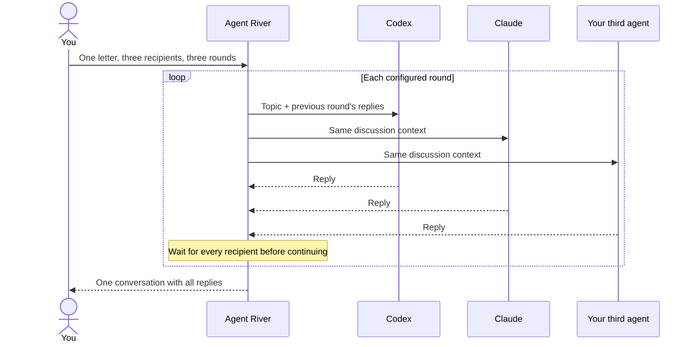

# Agent River

**One local post office for you and your AI agents.**

[English](README.md) · [繁體中文](README.zh-Hant.md)

Send a letter to Codex, Claude, or an agent you already run. Bring several agents into the same conversation, let them read each other's replies, and keep the discussion to a fixed number of rounds. Agent River handles delivery and keeps the correspondence together in a local web interface.

Your agents keep their own tools, models, and login sessions. Agent River starts their local processes and records requests, replies, and delivery status on disk. Model calls still use the providers configured by those agents.

## What you can do

- **Write to one agent.** Choose a recipient or let the post office route a request by capability. A single-recipient agent can ask a colleague for help and receive the result back.
- **Start a group discussion.** Select multiple recipients once. Each round waits for everyone's replies before sharing them with the group. Choose 1–3 rounds; the default is 3, with a final prompt to summarize agreement, differences, and next steps.
- **Steer the conversation.** Follow up with the whole group or selected agents. A new instruction starts a fresh round budget and prevents the previous discussion from adding more rounds.
- **Read the conversation without the delivery noise.** Your group letter appears once. Earlier messages, forwarding records, and retries are folded away; model choices and round progress use compact labels.
- **Connect existing agents.** Codex and Claude have built-in runners. Other agents can use a stdin/stdout adapter or poll the mailbox. Otter is one example of a separately connected agent, not a bundled dependency.
- **Use Telegram when you want it.** The optional dashboard supports owner commands, bounded sessions, agent launches, and approval workflows alongside the web post office.

Agent River 1.0 establishes the local post office and bounded group discussions as its core workflow for a single trusted local operator. The web post office is the main starting point; Telegram is optional. Incompatible changes to documented interfaces will be called out in release notes with migration guidance.

## How group discussion works



The first round gives each agent room to form an initial view. Later rounds ask them to respond to their peers; the final round asks for conclusions and remaining disagreements. This is a discussion protocol, not a guarantee that the models will agree.

Three recipients across three rounds means up to nine scheduled agent turns, before runner retries. A failed turn pauses further rounds. **Stop this conversation** blocks queued work and future rounds; a turn already running may still finish. Saved replies remain readable.

## Quickstart: local web post office

### Requirements

- Linux; systemd user services are used for the optional background service.
- Node.js 20 or newer and Git.
- The agent CLIs you want to use, installed and logged in locally: `codex` and/or `claude`.

The steps below enable both Codex and Claude. If you only use one, omit the other agent's enable command; the settings-file command is only needed for Claude.

### Install and configure

```sh
git clone https://github.com/Hsi431/agent-river.git
cd agent-river
npm install

RIVER_STATE="$HOME/.local/state/agent-river"

node bin/codex-agent.js agent-enable --state "$RIVER_STATE" --agent codex --kind coding
node bin/codex-agent.js agent-enable --state "$RIVER_STATE" --agent opus --kind review
node bin/codex-agent.js registry-seed --state "$RIVER_STATE"

node bin/codex-agent.js telegram-codex-policy-set --state "$RIVER_STATE" \
  --exchange-runner-enabled true \
  --workspace-root "$HOME" --default-repo "$PWD"

node bin/codex-agent.js exchange-runner-settings-write
node bin/codex-agent.js web --state "$RIVER_STATE" --repo "$PWD" --port 4310
```

Open **[http://127.0.0.1:4310/mail](http://127.0.0.1:4310/mail)** and write your first letter. The web process also runs postal delivery; you do not need the separate Telegram runner timers for this workflow. Keep the terminal running, or install the background service below.

A few names reflect the project's earlier Telegram implementation: `telegram-codex-policy-set` also controls postal runners, and `opus` is Claude's registry identity. The policy command does not require a Telegram bot. `exchange-runner-settings-write` creates Claude's restricted runner settings at `~/.config/codex-agent/opus-runner-settings.json`.

Use the same `--state` directory for all commands and services. Without it, the CLI defaults to `~/.codex/agent`. Agent River does not install or authenticate the provider CLIs for you.

### Invite the group

1. Choose **New letter → Group discussion**.
2. Select the available agents and a round count.
3. Describe the question, decision, or review you want discussed, then send.
4. Open **Add an instruction or follow-up** to address everyone or select specific recipients.

Group discussion uses each agent's configured model and reasoning settings. Single-recipient letters also allow explicit model and effort choices. A model must be supported by the recipient's provider and login method; unsupported choices fail rather than silently switching models.

### Run in the background

After stopping the foreground web process, run from the same checkout:

```sh
node bin/codex-agent.js web-service-write \
  --state "$RIVER_STATE" --repo "$PWD" \
  --dir "$HOME/.config/systemd/user" --port 4310
systemctl --user daemon-reload
systemctl --user enable --now codex-agent-web.service
```

## Connect another agent

An **exec** adapter reads one JSON request envelope from stdin and writes the final reply to stdout. Agent River owns claiming the letter, starting the adapter, and recording the reply.

```sh
node bin/codex-agent.js agent-join --state "$RIVER_STATE" \
  --name localbot --style exec \
  --exec '/absolute/path/to/your-agent --once' \
  --exec-timeout-seconds 300
```

Registration starts as pending. Approve it through the Telegram dashboard's join approval flow before it can receive letters; the web agent page's route-enable control is not a registration approval. Custom-agent onboarding currently still uses that dashboard flow.

For an agent that already runs continuously, the **poll** adapter uses token-protected mailbox commands instead. See the [agent integration guide](docs/AGENT_PROMPT_TEMPLATE.md) and [poll adapter example](scripts/poll-adapter-example.sh).

## Optional Telegram dashboard

The existing dashboard remains available for remote owner operations, direct agent launches, older message-budgeted sessions, and approval flows. Those sessions are separate from the web post office's round-based group discussions.

```text
@codex repo=myproject -- explain the failing test
@claude repo=myproject -- review this design
/session codex,opus -- compare these approaches
/say <session> focus on the simplest implementation
/agents
/status
```

Telegram needs a bot token and an owner allowlist. Start with the [Telegram operations guide](docs/AGENT_TELEGRAM_POLLING.md) and [session dashboard guide](docs/AGENT_RIVER_V3_SESSION_DASHBOARD.md). The `init` command scaffolds Telegram services; it is not required for the web-only quickstart above.

## Local state and execution boundaries

| Area | Behavior |
| --- | --- |
| Web access | Binds to `127.0.0.1`; intended for one trusted local operator, not a public multi-user service. |
| Storage | Requests, claims, replies, and audit events live in local JSONL files. No external database is required. |
| Model execution | Uses your installed agents and their provider access. Local storage does not make model inference offline. |
| Permissions | Postal Codex/Claude runners use their read-only profiles. Exec adapters retain their existing capabilities; correspondence grants no extra edit authority. |
| Bounds | Group discussions run for 1–3 rounds. Single-recipient delegation chains have a 12-request limit. Runner budgets and stop controls also apply. |
| Recovery | Stable delivery keys prevent duplicate round scheduling and allow incomplete fan-out to be repaired after restart. Provider execution itself is not guaranteed exactly once. |

Keep agent state, tokens, and provider configuration out of Git. Secret scanning is a precaution, not a guarantee that conversation logs contain no sensitive information. See [SECURITY.md](SECURITY.md) for the full trust model.

## When a reply does not arrive

Check **Automatic delivery** and the conversation's status first. Common causes are a disabled runner, missing Claude settings, an unavailable or unapproved agent, provider usage limits, or a model unsupported by the current login method.

```sh
node bin/codex-agent.js agent-registry-list --state "$RIVER_STATE"
node bin/codex-agent.js mail-list --state "$RIVER_STATE"
node bin/codex-agent.js mail-show --state "$RIVER_STATE" --id mail_...
journalctl --user -u codex-agent-web.service -n 50
```

Expand **Delivery records** for forwarding and retry details. A new owner instruction supersedes future automatic rounds from the previous instruction, but does not cancel a provider turn already in flight.

## Development and documentation

```sh
npm test
npm run test:no-memory
npm pack --dry-run
git diff --check
```

| Guide | Contents |
| --- | --- |
| [Post office](docs/POST_OFFICE.md) | Routing, group rounds, model choices, API, and operational details. |
| [Web interface](docs/WEB_GUI.md) | Local web service and the broader control-plane screens. |
| [Web architecture](docs/WEB_GUI_ARCHITECTURE.md) | Server, read models, actions, and browser security. |
| [Architecture](docs/ARCHITECTURE.md) | The broader agent control plane. |
| [Roadmap](docs/ROADMAP.md) | Planned and historical work. |
| [Contributing](CONTRIBUTING.md) | Contribution workflow. |

Licensed under [MIT](LICENSE).
