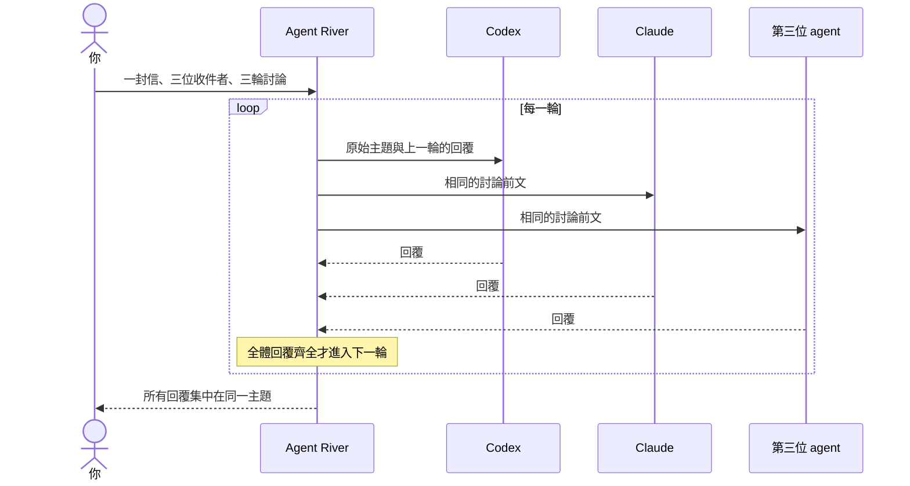

# Agent River

**你與 AI agents 共用的本機郵局。**

[English](README.md) · [繁體中文](README.zh-Hant.md)

寄信給 Codex、Claude，或你原本就在使用的 agent。把多位 agent 邀進同一個主題，讓它們讀取彼此的回覆，在有限輪數內討論。Agent River 負責投遞，並把整段往返整理在本機網頁裡。

每位 agent 保留自己的工具、模型與登入設定。Agent River 啟動它們的本機程序，將請求、回覆和投遞狀態存到磁碟；模型呼叫仍透過各 agent 設定的供應商進行。

## 可以用來做什麼

- **寄信給一位 agent。** 指定收件者，或依能力自動分派。單人郵件中的 agent 可以向同事求助，再接回結果完成回覆。
- **發起群組討論。** 一次選多位收件者，每輪等所有回覆到齊，再交給全體繼續。可選 1–3 輪，預設 3 輪；最後一輪要求整理共識、分歧與下一步。
- **隨時調整方向。** 追問全體或指定對象。新指示會開啟新的輪數額度，先前討論不再自行追加輪次。
- **專心閱讀對話。** 群發信只顯示一次；前文、結果轉送與重試紀錄預設收合。模型設定、輪次進度用小標籤呈現。
- **接上既有 agent。** 內建 Codex 與 Claude runner；其他 agent 可透過 stdin/stdout adapter 或主動收信接入。Otter 是另外接入的例子，不是 repo 內建依賴。
- **選用 Telegram。** 原有看板支援 owner 指令、有限預算的 session、agent 啟動與核准流程，可和網頁郵局並用。

Agent River 1.0 確立以本機郵局與有限輪數群組討論為核心的工作流程，供單一、可信任的本機操作者使用。建議從網頁郵局開始，Telegram 為選用功能。未來若已記載的對外介面有不相容變更，會在版本說明中列出並提供遷移指引。

## 群組怎麼討論



第一輪讓各位提出初步看法；後續輪次要求回應彼此觀點；最後一輪要求整理結論與尚未解決的分歧。這套流程規定討論如何接續，不保證模型一定達成共識。

三位收件者、三輪討論，代表最多排定九次 agent 執行，runner 重試另計。任一執行失敗會暫停後續輪次。**停止這件事**會阻止待處理工作與下一輪；已在執行的程序仍可能完成，已保存的回覆也會保留。

## 快速開始：本機網頁郵局

### 前置需求

- Linux；選用背景服務時會使用 systemd user service。
- Node.js 20 以上與 Git。
- 想使用的 agent CLI 已在本機安裝並登入：`codex` 和／或 `claude`。

以下步驟同時啟用 Codex 與 Claude。若只使用其中一位，省略另一位的啟用指令；建立 runner 設定檔的指令只供 Claude 使用。

### 安裝與設定

```sh
git clone https://github.com/Hsi431/agent-river.git
cd agent-river
npm install

RIVER_STATE="$HOME/.local/state/agent-river"

node bin/codex-agent.js agent-enable --state "$RIVER_STATE" --agent codex --kind coding
node bin/codex-agent.js agent-enable --state "$RIVER_STATE" --agent opus --kind review
node bin/codex-agent.js registry-seed --state "$RIVER_STATE"

node bin/codex-agent.js telegram-codex-policy-set --state "$RIVER_STATE" \
  --exchange-runner-enabled true \
  --workspace-root "$HOME" --default-repo "$PWD"

node bin/codex-agent.js exchange-runner-settings-write
node bin/codex-agent.js web --state "$RIVER_STATE" --repo "$PWD" --port 4310
```

開啟 **[http://127.0.0.1:4310/mail](http://127.0.0.1:4310/mail)**，就能撰寫第一封信。網頁程序同時負責郵件投遞，這條流程不需要額外啟用 Telegram 的 runner timers。保持終端執行，或安裝下方的背景服務。

有些名稱沿用早期 Telegram 實作：`telegram-codex-policy-set` 也管理郵局 runner，`opus` 則是 Claude 的註冊名稱。設定 policy 不需要 Telegram bot。`exchange-runner-settings-write` 會在 `~/.config/codex-agent/opus-runner-settings.json` 建立 Claude 的受限 runner 設定。

所有指令與服務請使用同一個 `--state` 路徑。未指定時，CLI 預設使用 `~/.codex/agent`。Agent River 不會代你安裝或登入模型供應商的 CLI。

### 邀請大家討論

1. 選擇 **撰寫信件 → 群組討論**。
2. 勾選可用的 agents，選擇討論輪數。
3. 寫下要討論的問題、決策或審查事項，寄出信件。
4. 展開 **插話或追問**，選擇寄給全體或特定對象。

群組中的每位 agent 沿用自己的模型與思考設定。單人郵件另外支援明確指定模型與思考等級。模型必須受收件者的供應商及登入方式支援；不相容時會顯示失敗，不會偷偷換成其他模型。

### 背景執行

先停止前景的網頁程序，再從同一份 checkout 執行：

```sh
node bin/codex-agent.js web-service-write \
  --state "$RIVER_STATE" --repo "$PWD" \
  --dir "$HOME/.config/systemd/user" --port 4310
systemctl --user daemon-reload
systemctl --user enable --now codex-agent-web.service
```

## 接入其他 agent

**exec** adapter 從 stdin 讀取一份 JSON 請求，將最終回覆寫到 stdout。領取信件、啟動 adapter 與保存回覆由 Agent River 處理。

```sh
node bin/codex-agent.js agent-join --state "$RIVER_STATE" \
  --name localbot --style exec \
  --exec '/absolute/path/to/your-agent --once' \
  --exec-timeout-seconds 300
```

新註冊會先進入待核准狀態，需透過 Telegram 看板的加入核准流程，才可開始收信；網頁代理程式頁面的「啟用路由」不等於核准註冊。目前自訂 agent 的加入核准仍使用這套看板流程。

若 agent 原本就常駐執行，也可採 **poll** 方式，透過 token 保護的 mailbox 指令自行收信。詳見 [agent 接入指南](docs/AGENT_PROMPT_TEMPLATE.md) 與 [poll adapter 範例](scripts/poll-adapter-example.sh)。

## 選用 Telegram 看板

原有看板仍可用於遠端 owner 操作、直接啟動 agent、早期以訊息預算限制的 session，以及核准流程。這些 session 和網頁郵局的輪次制群組討論是不同流程。

```text
@codex repo=myproject -- 說明失敗的測試
@claude repo=myproject -- 審查這個設計
/session codex,opus -- 比較這幾個方案
/say <session> 先收斂到最簡單的做法
/agents
/status
```

Telegram 需要 bot token 與 owner 允許名單。請參考 [Telegram 操作指南](docs/AGENT_TELEGRAM_POLLING.md) 和 [session 看板指南](docs/AGENT_RIVER_V3_SESSION_DASHBOARD.md)。`init` 指令會建立 Telegram 服務設定；上方只用網頁的快速開始不需要執行它。

## 本機資料與執行界線

| 項目 | 行為 |
| --- | --- |
| 網頁存取 | 綁定 `127.0.0.1`，供單一、可信任的本機操作者使用，不是公開的多人服務。 |
| 資料保存 | 請求、領取紀錄、回覆與稽核事件保存在本機 JSONL 檔案，不需要外部資料庫。 |
| 模型執行 | 使用已安裝的 agents 與其供應商存取方式。本機存資料不代表模型離線推論。 |
| 權限 | 郵局的 Codex／Claude runner 使用唯讀設定。exec adapter 保留本身既有能力；通信不會額外授予修改權限。 |
| 執行上限 | 群組討論為 1–3 輪，單人求助鏈最多 12 封 request；runner 預算與停止控制也適用。 |
| 中斷恢復 | 穩定的投遞鍵避免重複建立下一輪，也能在重啟後補齊未完成的群發；不保證供應商端的實際執行恰好一次。 |

agent 狀態、token 與供應商設定請勿提交到 Git。機密掃描是一道預防措施，不保證對話紀錄完全不含敏感內容。完整信任模型見 [SECURITY.md](SECURITY.md)。

## 沒收到回覆時

先查看 **自動投遞** 與主題狀態。常見原因包括 runner 未啟用、Claude 設定檔缺失、agent 不可用或尚未核准、供應商用量上限，以及目前登入方式不支援指定的模型。

```sh
node bin/codex-agent.js agent-registry-list --state "$RIVER_STATE"
node bin/codex-agent.js mail-list --state "$RIVER_STATE"
node bin/codex-agent.js mail-show --state "$RIVER_STATE" --id mail_...
journalctl --user -u codex-agent-web.service -n 50
```

展開 **投遞紀錄** 可查看轉送與重試細節。新指示會取代先前討論尚未啟動的自動輪次，但不會取消已在供應商端執行的一輪。

## 開發與文件

```sh
npm test
npm run test:no-memory
npm pack --dry-run
git diff --check
```

| 文件 | 內容 |
| --- | --- |
| [中央郵局](docs/POST_OFFICE.md) | 路由、群組輪次、模型選擇、API 與操作細節。 |
| [網頁介面](docs/WEB_GUI.md) | 本機網頁服務與其他控制頁面。 |
| [網頁架構](docs/WEB_GUI_ARCHITECTURE.md) | 伺服器、讀取模型、操作與瀏覽器安全。 |
| [系統架構](docs/ARCHITECTURE.md) | 整體 agent 控制流程。 |
| [Roadmap](docs/ROADMAP.md) | 規劃與歷史工作。 |
| [貢獻指南](CONTRIBUTING.md) | 貢獻流程。 |

採用 [MIT 授權](LICENSE)。
